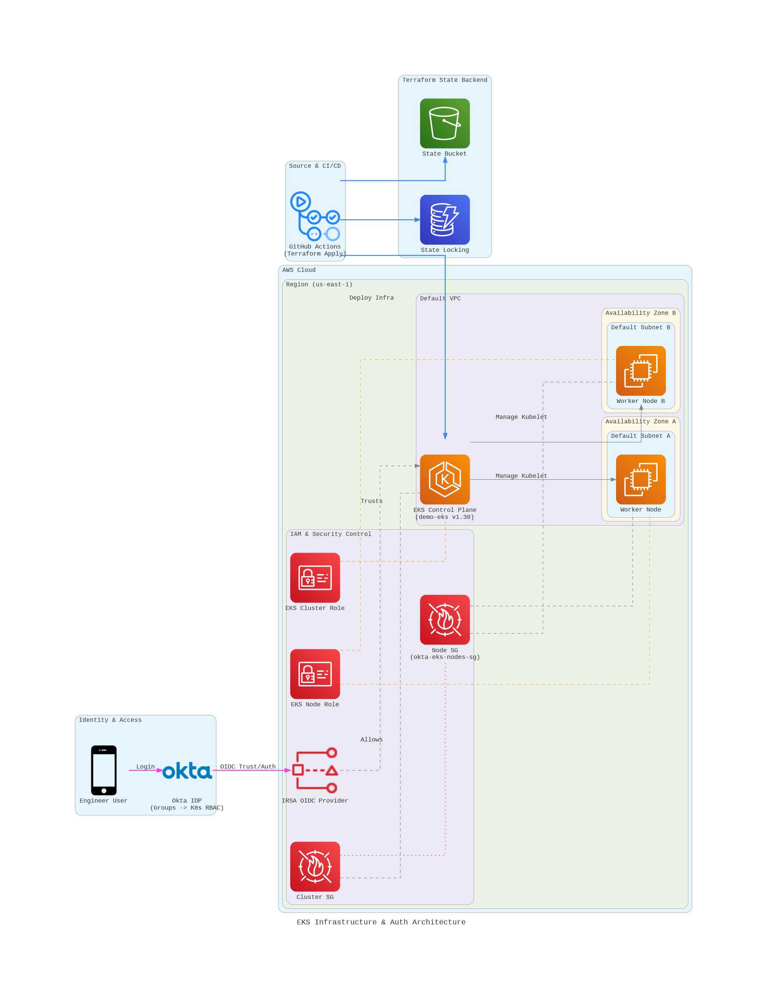

# Infrastructure as Code with Terraform, EKS, and Okta Integration



*Note: Architecture diagram showing AWS EKS cluster with Okta identity integration*

This repository contains Terraform configurations for setting up a production-grade AWS EKS cluster with Okta identity integration, including automated CI/CD pipelines, networking, and security components.

## Features

- EKS cluster with IRSA (IAM Roles for Service Accounts) enabled
- Okta identity integration with automated group management
- Default VPC and subnets (optimized for restricted environments)
- Unmanaged node groups via CloudFormation (for restricted environments)
- GitHub Actions CI/CD with automated plan and apply
- State management with encrypted S3 backend and DynamoDB locking
- Security groups with least-privilege access
- OIDC provider configuration for service account authentication
- Automated Okta group rules for user access management


## Prerequisites

- AWS CLI configured with appropriate credentials
- Terraform >= 1.0.0
- kubectl
- Okta admin account with API token access
- GitHub repository with Actions enabled


## Project Structure

```
.
├── modules/
│   ├── eks/              # EKS cluster configuration
│   │   ├── main.tf       # Cluster definition with IRSA enabled
│   │   ├── variables.tf  # Module variables
│   │   └── outputs.tf    # Cluster endpoints, OIDC URLs, security groups
│   ├── identity/          # Okta identity integration
│   │   ├── main.tf       # Okta groups, rules, and OIDC application
│   │   ├── variables.tf  # Module variables
│   │   └── outputs.tf    # Group IDs, client IDs, OIDC URLs
│   └── network/          # Network resources (currently using default VPC)
│       ├── main.tf        # VPC, subnets, NAT Gateway
│       ├── variables.tf  # Module variables
│       └── outputs.tf    # VPC and subnet IDs
├── main.tf                # Main infrastructure orchestration
├── variables.tf               # Root-level variable definitions
├── providers.tf           # AWS and Okta provider configurations
├── outputs.tf             # Root-level outputs
└── .github/
    └── workflows/
        └── infra.yml      # CI/CD pipeline configuration
```


## Getting Started

### 1. Configure Terraform Backend

Set up your Terraform backend configuration. You'll need:
- An S3 bucket for storing Terraform state
- A DynamoDB table for state locking

Configure your backend in a `backend.tf` file or via backend configuration flags.

### 2. Configure GitHub Secrets

**It is strongly advised and preferred to store these as GitHub repository secrets** (Settings → Secrets and variables → Actions) for secure CI/CD pipeline execution:

**Required:**
- `AWS_ACCESS_KEY_ID` - AWS access key for deployment
- `AWS_SECRET_ACCESS_KEY` - AWS secret access key
- `TF_STATE_BUCKET` - S3 bucket name for Terraform state
- `TF_STATE_TABLE` - DynamoDB table name for state locking

**Optional (for Okta integration):**
- `OKTA_API_TOKEN` - Okta API token
- `OKTA_ORG_NAME` - Okta organization name (without `-admin` suffix)
- `ENABLE_IDENTITY` - Set to `true` to enable Okta integration

### 3. Deploy Infrastructure

The CI/CD pipeline will automatically run on every push to `main`:

1. **Plan Phase**: Runs `terraform fmt`, `validate`, and `plan` on every push
2. **Apply Phase**: Automatically applies changes after successful plan

Alternatively, deploy locally:

```bash
terraform init
terraform plan
terraform apply
```

### 4. Configure kubectl

After deployment, configure kubectl to access your cluster:

```bash
aws eks update-kubeconfig --name demo-eks --region us-east-1
```

Or use the Terraform output:

```bash
terraform output configure_kubectl
```

## Okta Identity Integration

The identity module automates Okta configuration for EKS access:

### Features

- **Automated Group Management**: Creates `k8s-cluster-admins` group in Okta
- **Attribute-Based Access Control**: Auto-assigns users with `department="Engineering"` attribute to admin group
- **OIDC Application**: Configures Okta OAuth application for EKS cluster access
- **Group Rules**: Automatically assigns users to groups based on attributes

### Enabling Okta Integration

1. **Set GitHub Repository Secrets** (preferred) or export as environment variables for local deployment:
   ```bash
   export TF_VAR_enable_identity=true
   export TF_VAR_okta_org_name="dev-123456"  # Without -admin suffix
   export TF_VAR_okta_api_token="your-token"
   ```

2. **Deploy**:
   ```bash
   terraform apply
   ```

3. **Verify**:
   ```bash
   terraform output okta_client_id
   terraform output admin_group_id
   ```

### How It Works

- Users with `department="Engineering"` attribute are automatically added to `k8s-cluster-admins` group
- The Okta group rule applies retroactively to existing users and automatically to new users
- The OIDC application connects Okta users to the EKS cluster via authorization code flow
- Group membership grants `system:masters` access to the Kubernetes cluster

## State Management Security

The state management infrastructure includes:

- **Encrypted S3 Bucket**: State files encrypted at rest
- **DynamoDB State Locking**: Prevents concurrent modifications
- **Versioning**: S3 bucket versioning enabled
- **Access Control**: IAM-based access policies
- **Backend Isolation**: Unique bucket/table per environment

## Cost Optimization

This configuration is optimized for cost efficiency:

- **Default VPC**: Uses existing default VPC
- **Disabled CloudWatch Logging**: Cluster logging disabled (can be enabled for production)
- **Disabled KMS Encryption**: Cluster encryption disabled (can be enabled for production)
- **Unmanaged Node Groups**: Uses CloudFormation for nodes
- **Minimal Resources**: Conservative resource allocation
- **Single Region**: All resources in `us-east-1`

To reduce costs further:
- Scale down node groups during non-working hours
- Use Spot instances for nodes
- Enable features only when needed (e.g., CloudWatch logging, KMS encryption)


## Security Features

- **Private EKS Endpoint**: Cluster API endpoint configured for private access
- **Security Groups**: Least-privilege security group rules
- **IAM Roles**: Service-linked roles with minimal permissions
- **OIDC Integration**: IRSA enabled for service account authentication
- **Okta Integration**: Centralized identity management with attribute-based access
- **Encrypted State**: S3 backend with encryption enabled
- **State Locking**: DynamoDB prevents concurrent state modifications
- **GitHub Actions Security**: Secrets stored securely in GitHub


## CI/CD Pipeline

The GitHub Actions workflow (`.github/workflows/infra.yml`) provides:

- **Automated Validation**: Runs `terraform fmt` and `validate` on every push
- **Automated Planning**: Generates execution plan and uploads as artifact
- **Automated Deployment**: Applies changes automatically on push to `main`
- **Error Handling**: Gracefully handles Okta provider errors when identity is disabled
- **Manual Approval**: Can be configured for production environments

### Workflow Jobs

1. **Plan Job**: 
   - Checks out code
   - Configures AWS credentials
   - Exports Okta secrets (if available)
   - Runs `terraform fmt`, `validate`, and `plan`
   - Uploads plan artifact

2. **Apply Job**:
   - Downloads plan artifact
   - Applies infrastructure changes
   - Runs automatically on push to `main`


## Troubleshooting

### Common Issues

**Terraform Backend Not Found**
- Ensure your S3 bucket and DynamoDB table are configured correctly
- Verify backend configuration in your Terraform setup

**Okta Provider Validation Errors**
- Ensure `ENABLE_IDENTITY` GitHub repository secret is set to `true` if using Okta
- Verify `OKTA_API_TOKEN` and `OKTA_ORG_NAME` GitHub repository secrets are correct
- Check that org name doesn't include `-admin` suffix

**EKS Cluster Creation Fails**
- Verify IAM roles exist: `eksClusterRole` and `eksNodeRole`
- Check IAM permissions for EKS cluster and node group creation
- Ensure default VPC and subnets exist in the region

**Node Group Creation**
- Ensure EC2 keypair exists: `okta-eks-nodes-keypair`
- Verify node security group exists: `okta-eks-nodes-sg`

### Cleanup

To remove all resources:

```bash
terraform destroy
```

This will:
- Destroy all Terraform-managed resources
- Remove S3 bucket and DynamoDB table (if managed by Terraform)
- Clean up local Terraform files

